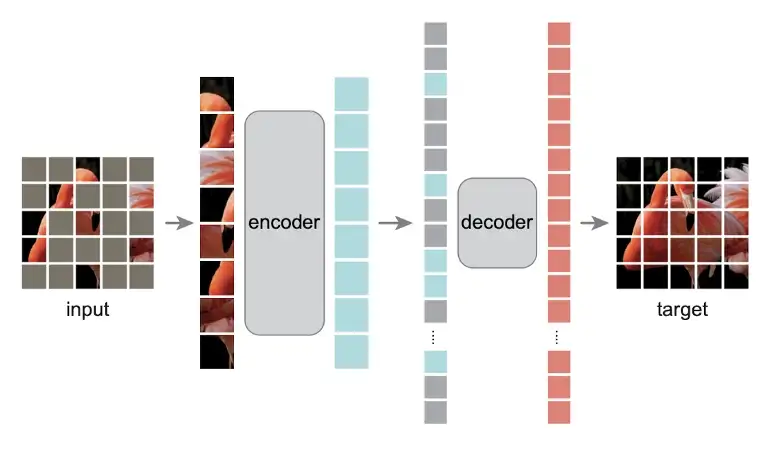
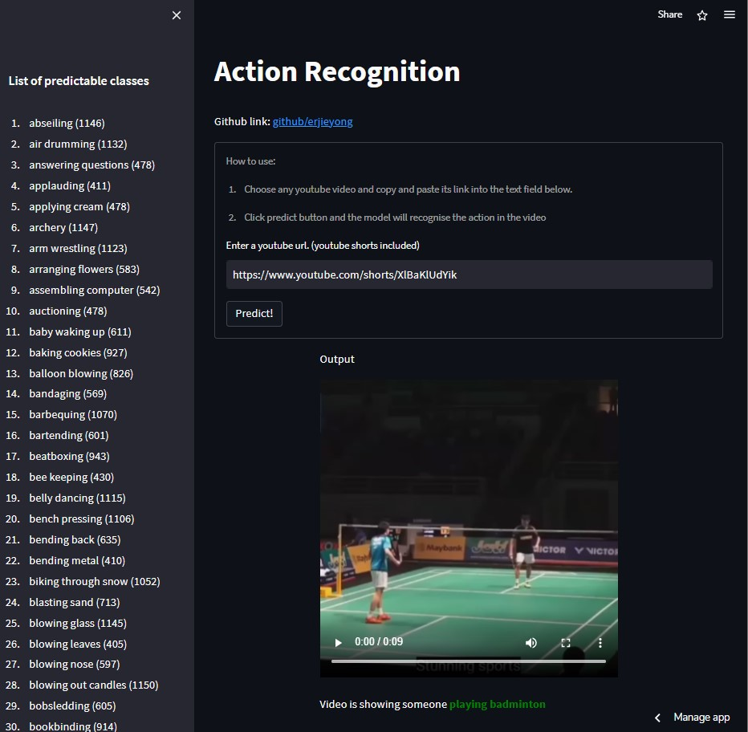

# CCTV Surveillance Assistance

## Problem Statement
With the proliferation of CCTVs being installed everywhere, it has become humanely impossible for a human to scan through all footages and observe any issue that happens in real time. 

AI assisted surveillance can be break down in to 3 general steps
1) Identify situation for escalation (Action Recognition)
2) Identify subject for escalation
3) Subject ReIdentification to continue tracking beyond original camera view

For example, a fight might happen in a isolated corner of an airport without passerby but with CCTV access.
1) The AI that is constantly monitoring all the screen will recognise that a fight has occured and escalate to a human for further action
2) The AI will assist to identify the person who started the fight though person detection
3) Finally, based on information from step 2, begin person reidentification through all CCTVs in the vicinity to quickly track down the subject.

## Scope
In this project, we will attempt to make use of machine learning to showcase the capabilities of computer vision in performing action recognition in 2 areas
- Action recognition of the entire video content
- Fall detection of people in the video content

# Action Recognition of entire video
## Business Requirements
We have identified the following requirements
- Dataset on human behavior and actions
- Pre-trained model on said dataset that is fast and works on video

## Dataset
The relevant and popular datasets based on paperswithcode are as follows:
Dataset | Description | No of classes | Best Model
-------- | ---------- | -------- | -------- |
UCF101 | Comprises of 13320 video clips from 5 types of actions (Body motion, Human-human interactions, Human-object interactions, Playing musical instruments and Sports) | 101 | SMART
HMDB51 | Comprises of 6849 video clips from 51 categories (such as “jump”, “kiss” and “laugh”) | 51 | DEEP-HAL with ODF+SDF
AVA v2.2 | Crossover between AVA and Kinetics doubling the number of annotations of Kinetics 799 with increase of videos by over 500x | 700 | VideoMAE
Kinetics 400 | Comprises of around 500,000 clips covering 400 classes | 400 | SMART

## Model Evaluation
Based on the above selected dataset, we will evaluate SMART, DEEP-HAL with ODF+SDF and VideoMAE
Model | Code Availability | Speed Ranking | Community Interest | Selection
-------- | ---------- | -------- | -------- | -------- |
SMART | Code not available | NA | NA | |
DEEP-HAL with ODF+SDF | Code not available | NA | NA | |
VideoMAE | Yes* | 1 | Available on huggingface, colab | ✓ | 

Through the usage of mask encoder (i.e. hiding > 75% of the data), VideoMAE is able to obtain blazingly fast inference speed (3.2x) and with high performance and low computational power. Moreover, VideoMAE has also been trained for Kinetics-400, UCF101 and HMDB51 datasets and achieve very respectable results as well. Hence, we will proceed to go with VideoMAE as it gives an overall best result with good balance in speed and accuracy.

  
<i>Figure 1: Illustration of Masked Autoencoder. [source](https://medium.com/the-last-neural-cell/08-summary-masked-autoencoder-is-all-you-need-for-any-modality-3ced90dd0a26)</i>

# Fall Detection
## Business Requirements
We have identified the following requirements
- Pre-trained on dataset with human poses
- Model should be fast and works on video

## Model Evaluation
While there are other pose estimation models out there, the most popular being ViTPose, it's hugging face showcase proved discouraging as it took more than 10 minutes to run one of its default video. In the end, YOLOv7-Pose was chosen because of the popularity within the community and my familiarity with the model. 

# Deployment
To reduce deployment time, we rely on a pre-trained model from VideoMAE that is available on HuggingFace. This saves us alot of time as we do not have to train again and huggingface greatly simplifies the preprocessing and inference steps.

Our deployment process follows the following steps:
1) Given the luxury of VideoMAE being available on huggingface spaces, we were able to test out several videos to ensure that the model works
2) We selected finetuned model ('videomae-base-finetuned-kinetics') on hugging face as it is trained on kinetics that include various human behaviours applicable to our problem statement such as punching, kicking, wrestling and crying. It also includes other activities that is undesirable as it caused disturbances (especially in a airport or mall) such as busking, playing football, jumping and singing.
3) Perform testing of model on jupyter notebook
4) Deployment on streamlit
  - Note that fall detection currently only works with the default youtube video. This function will be disabled for other videos

[**Streamlit link**](https://erjieyong-data-scie-action-recognition-videomaestreamlit-78ydks.streamlit.app/)

  
<i>Figure 2: Screenshot of streamlit app with predicted output in green.</i>

# Future Works

While we are able to showcase the capabilities of action recognition using VideoMAE, there are a still room for improvements
- finetune on datasets that include more human behaviors such as riots and fighting
- finetune the pose estimation to be more accurate
- finetune the fall detection algorithim
- test both models on real time cctv footage and run them using GPU
- multi-output classification (in a big cctv footage, there could be various activities happening in each frame)